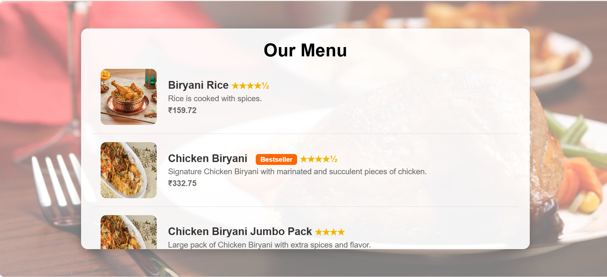

<div align="center" style="background-color:#0D1117; padding: 20px; border-radius: 10px;">

<h2 align="left" style="color:white;">🍽️ Restaurant Website</h2>


### About the Project

This is a **Restaurant Website** built using **HTML, CSS, and Bootstrap**. It provides a responsive design showcasing the menu, location, and contact details of the restaurant.

---

### Features
✔️ Fully responsive design <br>
✔️ Attractive UI using Bootstrap <br>
✔️ Menu page with images <br>
✔️ Contact form <br>
✔️ Location details <br>
✔️ User authentication (Login & Registration) <br>

---

### 🖼️ Screenshots
#### Home Page


#### Menu Page


#### About Page


#### Location Page


#### Contact Page


#### Login Page


#### Registration Page


---

### 🛠️ Tech Stack
<div align="left">
  
  
  
  
  
</div>

---

### 📂 Setup
To run this project locally, follow these steps:
```bash
git clone https://github.com/saivivek7881/restaurant-website.git
cd restaurant-website
open index.html
```

---

### 🔗 Connect with Me
<div align="left">
  <a href="mailto:saivivekgundeti7881@gmail.com">
    
  </a>
  <a href="https://www.instagram.com/_im_vivek_._" target="_blank">
    
  </a>
</div>

</div>